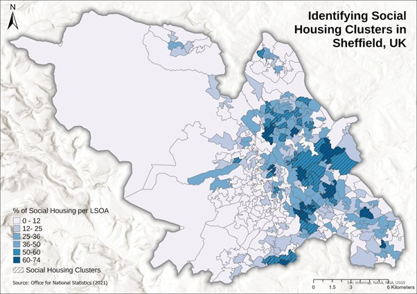
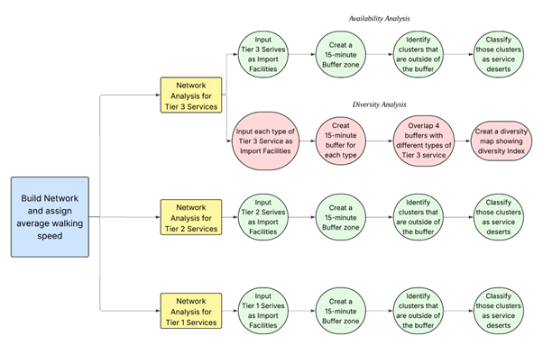
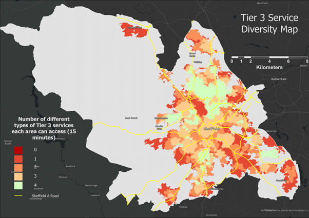

<h2>🏙️ 15-Minute City Analysis</h2>

<b>Accessibility analysis of social housing communities to essential services in Sheffield, United Kingdom.</b>

<h3>Introduction</h3>

The 15-minute city, an urban planning concept also known as ‘chrono-urbanism’, aims to ensure residents can access essential services within a 15-minute walk. This GIS project is commissioned by Urban Retrofit. It investigates how social housing communities in Sheffield adhere to the 15-minute city concept. The study supports Sheffield City Council in promoting sustainability, reducing car dependency, and improving quality of life for lower-income communities while addressing urban inequalities.

<h3>Methodology and Data</h3>

Our study combined spatial analysis, census data, and accessibility metrics to evaluate social housing clusters and their proximity to essential services.

<h4>Defining Social Housing Clusters</h4>

We used data from the 2021 Census provided by the Office for National Statistics (ONS) to analyse housing tenure types in Sheffield at the LSOA level. After cleaning the data in Python, we identified areas with high levels of social housing by combining two categories: council/local authority rented and other social rented homes.

The data was visualised to highlight clusters of social housing, showing areas with the highest concentration of social housing units.

  

<h4>Classification of Essential Services</h4>

Essential services were classified based on their ability to serve basic urban functions. Services were categorised into three tiers based on their importance:

<ul>
  <li><strong>Tier 3:</strong> Essential for basic community needs</li>
  <li><strong>Tier 2:</strong> Support daily movement and engagement with broader society</li>
  <li><strong>Tier 1:</strong> Improve quality of life</li>
</ul>

<h4>Essential Services by Tier</h4>
<table border="1" cellspacing="0" cellpadding="6">
  <tr>
    <th>Tier 3 (Basic Community Needs)</th>
    <th>Tier 2 (Daily Movement & Engagement)</th>
    <th>Tier 1 (Quality of Life)</th>
  </tr>
  <tr>
    <td>Pharmacies & GPs (Health) Dentists (Health) Health Centres (Health) Primary & Secondary Schools (Education) Places of Worship (Religion) Convenience Food Shops (Food)</td>
    <td>Other Food Shops Public Toilets ATMs Banks Post Office</td>
    <td>Greenspaces Cafés & Restaurants Shopping Centres Leisure Centers Youth Clubs Barbers & Hairdressers</td>
  </tr>
</table>

<h4>Network Analysis</h3>

The main purpose of our study is to evaluate the accessibility of a 15-minute city for social housing communities. First, we created population-weighted centroids for each social housing community. Then, we used the <strong>Network Analyst Tool</strong>, along with a road network sourced from Ordnance Survey (OS), to conduct our accessibility analysis.

<h4>Workflow</h4>

The workflow for the accessibility analysis is illustrated below:

  

<h2> Results</h2>

<h3>📊 Tier 3 Service Accessibility Diversity Analysis</h3>

<b>Service diversity</b> measures how many different types of Tier 3 services (the most essential services) a social housing cluster can access. 
Even if a cluster is not a service desert, it may only have access to some services (e.g., only health services) while lacking others.

Our analysis shows that only <b>25.5% of Sheffield social housing clusters</b> can access <b>all Tier 3 services</b> within a 15-minute walking distance. 
Clusters with higher service diversity are mostly in the northwest, while clusters in the southeast are more underserved.

  

<h3>💬 Discussion</h3>

Our study shows that all Tier 3 service deserts are in the south-east, and most Tier 2 deserts are in the east of Sheffield. 
This reflects historical inequalities from 19th-century industrialisation, which created an east-west divide that still affects access to services today.

Service diversity is often overlooked. Gentrification can worsen inequalities by bringing services that cater mainly to affluent newcomers, while essential Tier 3 services like affordable shops and health centres are neglected.

Local authorities should actively ensure vulnerable communities have access to essential services through subsidies, regulation, or direct provision.

